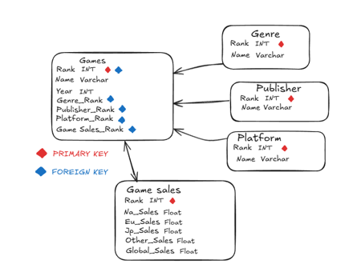

# GAMES API
Este es un ejemplo de una API de juegos construida con fastapi por Eric G.

## Instalación
 Uv es un gestor de paquetes extremadamente rápido para Python que nos servirá para limitar los paquetes que instalemos en nuestros proyectos. De este modo no tendremos que tener instalados todos los paquetes en los diferentes espacios de trabajo sino que tendremos instalados en cada espacio de trabajo los paquetes necesarios para poder trabajar.

### Instrucciones de instalación: 
 - Ejecutamos el terminal el CMD en Python y para instalarlo usaremos el comando:

    - Windows: 
    ```sh
    powershell -ExecutionPolicy ByPass -c "irm https://astral.sh/uv/install.ps1 | iex"
    ```
    - Mac o Linux: 
    ```sh
    curl -LsSf https://astral.sh/uv/install.sh | sh
    ```
### Comandos:
Para sincronizar las dependencias del proyecto con el entorno:
```sh
uv sync
```
Para agregar una dependencia al proyecto:
```sh
uv add
```
Para eliminar una dependencia del proyecto:
```sh
uv remove
```
Para ver el arbol de dependencias del proyecto:
```sh
uv tree
```


### Activar el entorno virtual:
Con este comando activaremos el entorno virtual donde se instalaran los paquetes y ejecuciones de Python:
```sh
.venv/bin/activate
```


## Ejecucción
Para lanzar el proyecto usaremos este comando:
```sh
uvicorn src.main:app --reload
```
Para ejecutar en la terminal el archivo sin que nos de error por el entorno:
```sh
python -m scripts.filename
```

## Descripción del proyecto
- `/` Devuelve el mensaje de Hello Eric cuando accedamos a la ruta y nos servirá para comprobar que funciona correctamente la conexión con el servidor.
- `/games/id/{id}` Devuelve los datos del juego con el ID que le hayamos pasado.
- `/games/name/{name}` Devuelve todos los datos del juego con el nombre que le hayamos pasado.
- `/games/genre/{genre}` Devuelve todos los juegos con el genero que le hayamos pasado.
- `/games/genres` Devuelve todos los generos distintos de los juegos como una lista.
- `/games/publisher` Devuelve todos los publisher distintos de los juegos como una lista.
- `/games/platform` Devuelve todas las plataformas distintas de los juegos como una lista.
- `/games/year` Devuelve todos los años distintos de los juegos como una lista.
- `/games/publisher/{publisher}` Devuelve los 100 primeros juegos del publisher que le hayamos pasado.
- `/games/platform/{platform}` Devuelve los 100 primeros juegos de la plataforma que le hayamos pasado.
- `/games/genre/{genre}` Devuelve los 100 primeros juegos del genero que le hayamos pasado.
- `/games/year/{year}` Devuelve los 100 primeros juegos del año que le hayamos pasado.
- `/games/year/{year_1}/{year_2}` Devuelve los 100 primeros juegos entre el año 1 y el año 2 que le hayamos pasado.
- `/games/eu_sales/{eu_sales_1}/{eu_sales_2}` Devuelve los 100 primeros juegos entre las eu_sales_1 y las eu_sales_2.
- `/games/na_sales/{na_sales_1}/{na_sales_2}` Devuelve los 100 primeros juegos entre las na_sales_1 y las na_sales_2.

## Diagrama del proyecto


En este proyecto tenemos 5 tablas para categorizar los juegos:

- **Games:** Será nuestra tabla principal y tendremos un **ID, nombre y año** del videojuego

- **Genre:** Tendremos un **ID y el nombre del genero** del videojuego

- **Publisher:** Tendremos un **ID y el nombre del publisher** del videojuego

- **Platform:** Tendremos un **ID y el nombre de la plataforma** en la que salió el videojuego

- **Game Sales:** Tendremos un **ID y sus ventas en NA, EU, JP, Globales y otras ventas**

## SQLModel
SQLModel es una librería que nos permite desde el código Python poder interactuar con las bases de datos SQL. 
También está diseñado SQLModel para simplificar la interacción con bases de datos SQL en FastAPI

## SQLite
La base de datos que estamos usando en este proyecto se trata de SQLite.
SQLite es un sistema de gestión de base de datos relacional que no requiere de servidor para funcionar.

Justificación de base de datos:
- Ligero y sin servidor
- Almacena los datos en un solo archivo
- Compatible con SQL

## To do
- Poner todas las funciones que habían en fake games en games db pero usando lo de la base de datos menos el get games by field